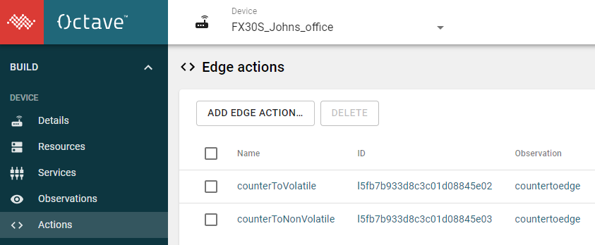

## Why use this?
It aids developing and debugging Octave Edge Actions 

* Direct live view of Octave Edge action JavaScript console.log messages
* It works without developer mode being enabled
* It is running directly on the Edge Device - OTA data transmission and delay issues are avoided
* The debug is captured in timestamped sequence even between different Edge Actions
 

## What is this?
A filter application written in Python that runs on the Octave Edge device command line.

## What does it do?
It takes the standard WP 7xxx Legato output and filters for just Octave Javascript debug 


## Step by step guide


**Step 1** 
Get the Edge Action Names vs IDs by select and copy from the Octave dashboard to extract the information


Login to the Octave dashboard and scrape the Action names vs Action ids  



```
counterToVolatile l5fb7b933d8c3c01d08845e02
counterToNonVolatile l5fb7b933d8c3c01d08845e03
```

**Step 2**
Shell into the target Octave Edge device

Usually using the USB OTG port.

From a linux host
```
ssh root@192.168.2.2
```

From a Windows host  
Use something like Teraterm (first load the Sierra Windows WP driver from https://source.sierrawireless.com/)
 

**Step 3**
Create the debug command 

By adding the Action Names and IDs seperated by : to the end of command logread -f | python actionLog.py 
Note each pair is split by a  comma ',' 

For example
```
logread -f | python actionLog.py counterToVolatile:l5fb7b933d8c3c01d08845e02,counterToNonVolatile:l5fb7b933d8c3c01d08845e03
```

**Step 4** 
Execute the command above on the Octave Edge Device via the shell interface

Example debug output
```
16:15:36   l5fb7b933d8c3c01d08845e02    counterToVolatile  "volatile ip event ={\"value\":19,\"timestamp\":1606839336.337884}"
16:15:41   l5fb7b933d8c3c01d08845e03    counterToNonVolati "nonVol retval = {\"vr://resource\":[\"counter={\\\"value\\\":20,\\\"timestamp\\\":1606839341.3
16:15:41   l5fb7b933d8c3c01d08845e02    counterToVolatile  Datahub.read: Failed to read from /app/virtual/john/test/value
16:15:41   l5fb7b933d8c3c01d08845e02    counterToVolatile  "/virtual/hmi/statem/value not configured yet - could be a reboot"
16:15:41   l5fb7b933d8c3c01d08845e02    counterToVolatile  "volatile ip event ={\"value\":20,\"timestamp\":1606839341.337893}"
16:15:41   l5fb7b933d8c3c01d08845e02    counterToVolatile  "retval = {\"vr://john/test\":[\"volatile count={\\\"value\\\":20,\\\"timestamp\\\":1606839341.
16:15:46   l5fb7b933d8c3c01d08845e02    counterToVolatile  "volatile ip event ={\"value\":21,\"timestamp\":1606839346.33825}"
16:15:51   l5fb7b933d8c3c01d08845e02    counterToVolatile  "volatile ip event ={\"value\":22,\"timestamp\":1606839351.338227}"
```

## Example filtered log vs raw logread 

**filtered log** (with no action names set)

If no action names are set the tool functions with the Action name replaced with xxxxxxxxxx
```
root@fx30s:~# logread -f | python actionLog.py
12:32:06   l5fb7b933d8c3c01d08845e02    xxxxxxxxxx         "volatile ip event ={\"value\":36,\"timestamp\":1606825926.233646}"
12:32:11   l5fb7b933d8c3c01d08845e02    xxxxxxxxxx         "volatile ip event ={\"value\":37,\"timestamp\":1606825931.233316}"
12:32:16   l5fb7b933d8c3c01d08845e02    xxxxxxxxxx         "volatile ip event ={\"value\":38,\"timestamp\":1606825936.233675}"
```

**raw logread**
The same information as the above filtered example raw from the logread command
```
root@fx30s:~# logread -f
Dec  1 12:32:06 fx30s user.info Legato:  INFO | modemDaemon[1103]/le_pa T=main | pa_mrc_qmi.c pa_mrc_GetNetworkRegState() 2332 | called
Dec  1 12:32:06 fx30s user.info Legato:  INFO | actions[896]/actionRunner T=Javascript | actionRunner_JS.c js_LogInfoHandler() 1295 | action_id:l5fb7b933d8c3c01d08845e02 | "volatile ip event ={\"value\":36,\"timestamp\":1606825926.233646}"
Dec  1 12:32:11 fx30s user.err Legato: =ERR= | location[1086]/components T=main | location.c Sample() 105 | Failed to read sensor (LE_OUT_OF_RANGE).
Dec  1 12:32:11 fx30s user.info Legato:  INFO | modemDaemon[1103]/le_pa T=main | pa_mrc_qmi.c pa_mrc_GetNeighborCellsInfo() 5052 | Main cell in GERAN, get 5 GERAN neighboring cells
Dec  1 12:32:11 fx30s user.info Legato:  INFO | actions[896]/actionRunner T=Javascript | actionRunner_JS.c js_LogInfoHandler() 1295 | action_id:l5fb7b933d8c3c01d08845e02 | "volatile ip event ={\"value\":37,\"timestamp\":1606825931.233316}"
Dec  1 12:32:11 fx30s user.info Legato:  INFO | modemDaemon[1103]/le_pa T=main | pa_mrc_qmi.c pa_mrc_GetNetworkRegState() 2332 | called
Dec  1 12:32:11 fx30s user.warn Legato: -WRN- | router[1154]/components T=main | store.c st_GetEvent() 514 | No events available for encoding
Dec  1 12:32:11 fx30s user.info Legato:  INFO | avcDaemon[971]/avcDaemon T=main | coap.c le_coap_Push() 585 | Push: CoAP POST from device
Dec  1 12:32:11 fx30s user.err kernel: [  223.132213] disconnect_to_bam: shutdown completion time was: 5000 msec
Dec  1 12:32:14 fx30s user.err kernel: [  226.225106] disconnect_to_bam: shutdown completion time was: 5000 msec
Dec  1 12:32:16 fx30s user.info Legato:  INFO | actions[896]/actionRunner T=Javascript | actionRunner_JS.c js_LogInfoHandler() 1295 | action_id:l5fb7b933d8c3c01d08845e02 | "volatile ip event ={\"value\":38,\"timestamp\":1606825936.233675}"
```

**more examples**
```
# logread -f | python actionLog.py action_id 876876
# logread -f | python actionLog.py usprxedge:l5f58e19c2ebc93700459b5ca,hmigauge:l5f58e19cda3994a414b567fd,hmisignalled:l5f58e19c2ebc93700459b5c4
# logread -f | python actionLog.py usp:l5f104a5ff936e13e915d6fb9
```


